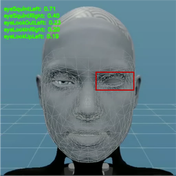

# Facial Expression Generation for Emotionally Responsive Humanoids

* **Summer Research Internship Project**
  Faculty of Science and Engineering, Macquarie University
* **Supervisors:** Penny (Peizhen Li), Prof. Longbing Cao (Distinguished Chair in AI)

---

## 🧹📊 Stage 1: Data Cleaning & Annotation

**Duration:** 15 Dec 2025 – 19 Dec 2025

### 🔍 Task 1: Detection Error Inspection

We have recorded a set of humanoid facial expression animations and applied **MediaPipe Face Landmarker** to extract facial landmarks and blendshape coefficients. These video data will be used to train models for humanoid facial expression generation. However, we have observed that some detection results are inaccurate or unstable.

*Example error cases: landmarks around the eyelids are incorrectly detected*

**Your task:**

* Watch the provided videos carefully.
* Identify several typical detection errors (e.g., misaligned landmarks, unstable eyelid detection, missing facial regions).
* For each identified error:

  * Provide a **screenshot** illustrating the issue.
  * Write a **brief description** explaining what is wrong and why it is problematic for downstream modeling.

📦 **Submission format:**
Please submit **either a PowerPoint (.ppt/.pptx) or a Word document (.doc/.docx)** summarizing:

* Example screenshots of detection errors
* Short explanations for each error case

**Video resources:**
[Link to videos](https://drive.google.com/drive/folders/1y508WpiocS9l9dtZ2e_QRJSpngERUEuK?usp=sharing)

---

### 😊😐😞 Task 2: Sentiment Labeling (Listener Reactions)

**Objective**
Label the *sentiment of the listener* in conversational video clips. You will observe individuals who are listening to someone else speak and annotate their facial expressions and non-verbal reactions.

**Important note:**
Please base your judgment **only on the listener’s reactions**, not on the spoken content or the speaker’s emotions. Our goal is to analyze how listeners *feel* about the information they are receiving.

**Labeling task**
Assign **one** of the following sentiment labels to each video clip:

* **Positive**: The listener appears engaged or pleased (e.g., smiling, nodding, showing agreement or enthusiasm).
* **Negative**: The listener appears confused, displeased, or resistant (e.g., frowning, shaking their head, showing disagreement or disgust).
* **Neutral**: The listener shows minimal emotional expression (e.g., flat affect, calm attention without clear positive or negative cues).

**Additional guidance**

* Videos recorded within the **same session** may exhibit **similar or identical sentiments**. Please label each clip carefully, but keep session-level consistency in mind.

---

### 🔒 Confidentiality & Data Privacy

This dataset is **confidential and sensitive**.

* Videos must **not** be shared, copied, or uploaded to public platforms.
* Data must **not** be disclosed to anyone outside the immediate research team.
* All materials are to be used **solely** for this research project.

---

### 📂 Data Access & Submission

* **Data location:**

  * Training set: [https://drive.google.com/drive/folders/1cVoHYvzfgeSkdXtovc4nHd70zg_SmyH_?usp=sharing](https://drive.google.com/drive/folders/1cVoHYvzfgeSkdXtovc4nHd70zg_SmyH_?usp=sharing)
  * Validation set: [https://drive.google.com/drive/folders/1tZV2nv4u79_-M-AiPi5NZBnavG_o4M6d?usp=sharing](https://drive.google.com/drive/folders/1tZV2nv4u79_-M-AiPi5NZBnavG_o4M6d?usp=sharing)

* **Output format:**
  Please submit **either a CSV (.csv) or Excel (.xlsx) file** containing your sentiment labels (please refer to the attached example file for formatting and naming conventions). 📊

  CSV file (please refer to the attached example file for formatting and naming conventions).

---

## 📚 Reading List

To better understand the background and motivation of this project, please review the following papers:

* [X2C: A Dataset Featuring Nuanced Facial Expressions
for Realistic Humanoid Imitation](https://arxiv.org/pdf/2505.11146)

* [Responsive Listening Head Generation: A Benchmark Dataset and Baseline](https://arxiv.org/pdf/2112.13548)

* [REACT 2025: The Third Multiple Appropriate Facial Reaction Generation Challenge](https://arxiv.org/pdf/2505.17223)

---

## 🧪🗂️ Stage 2: Test Dataset Curation

**Duration:** 5 Jan 2026 – 16 Jan 2026

(Details to be provided closer to the start date.)

---

## 🤖🌍 Stage 3: Real-World Robot Experiments

**Duration:** 19 Jan 2026 – 23 Jan 2026

(Details to be provided closer to the start date.)
