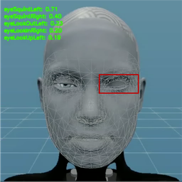
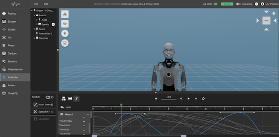
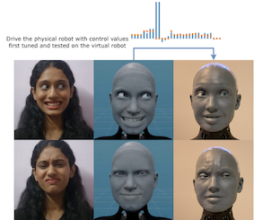

# Facial Expression Generation for Emotionally Responsive Humanoids

* **Summer Research Internship Project (2025)**

  Faculty of Science and Engineering, Macquarie University
* **Supervisors:** Penny (Peizhen Li), Prof. Longbing Cao (Distinguished Chair in AI)
* **Interns:** Vathana Khun, Md Juhaer Adittya Pasha

---

## 🧹📊 Stage 1: Data Cleaning & Annotation

**Duration:** 15 Dec 2025 – 19 Dec 2025

### 🔍 Task 1: Detection Error Inspection

We have recorded a set of humanoid facial expression animations and applied **MediaPipe Face Landmarker** to extract facial landmarks and blendshape coefficients. These video data will be used to train models for humanoid facial expression generation. However, we have observed that some detection results are inaccurate or unstable.

*Example error cases: landmarks around the eyelids are incorrectly detected*

**Your task:**

* Watch the provided videos carefully.
* Identify several typical detection errors (e.g., misaligned landmarks, unstable eyelid detection, missing facial regions).
* For each identified error:

  * Provide a **screenshot** illustrating the issue.
  * Write a **brief description** explaining what is wrong and why it is problematic for downstream modeling.

📦 **Submission format:**
Please submit **either a PowerPoint (.ppt/.pptx) or a Word document (.doc/.docx)** summarizing:

* Example screenshots of detection errors
* Short explanations for each error case

**Video resources:**
[Link to videos](https://drive.google.com/drive/folders/1y508WpiocS9l9dtZ2e_QRJSpngERUEuK?usp=sharing)

### 🌟 Extended Exercise (Optional)
To further enrich this task, we have also provided the raw humanoid facial expression animation videos: [raw video resources](https://drive.google.com/drive/folders/1lKMjNPekqGX8hiYOKSDfYlYyo8XA5oNk?usp=sharing), feel free to utilize [MediaPipe](https://ai.google.dev/edge/mediapipe/solutions/vision/face_landmarker), [OpenFace](https://github.com/TadasBaltrusaitis/OpenFace) or other tool to analyze these videos and submit any interesting discoveries: e.g., under what condition the tools fail to detect accurate facial landmarks, blendshapes or any other facial features.

You are encouraged to analyze these videos using [MediaPipe Face Landmarker](https://ai.google.dev/edge/mediapipe/solutions/vision/face_landmarker), [OpenFace](https://github.com/TadasBaltrusaitis/OpenFace), or any other facial analysis tools of your choice (e.g., landmark detectors, blendshape extractors).

  
Click to expand

  
**Suggested directions include (but are not limited to):**

- Investigating conditions under which facial analysis tools fail or become unstable, such as:

- Extreme or subtle facial expressions

- Rapid motion or temporal jitter

- Self-occlusion (e.g., eyelids, mouth corners)

- Comparing the performance of different tools (e.g., MediaPipe vs. OpenFace) on the same sequences.

Identifying systematic biases or limitations when applying human-oriented facial analysis models to humanoid or animated faces.

Submission (optional):
You may include your findings as an additional section in the same PowerPoint or Word document. Screenshots, short video clips, plots, or concise qualitative observations are all acceptable, provided they clearly support your conclusions. The submission deadline is **the end of the project**.

The goal of this extended exercise is to encourage deeper exploration and critical thinking about the robustness and limitations of current facial analysis pipelines when applied to humanoid facial expression data.

---

### 😊😐😞 Task 2: Sentiment Labeling (Listener Reactions)

**Objective**
Label the *sentiment of the listener* in conversational video clips. You will observe individuals who are listening to someone else speak and annotate their facial expressions and non-verbal reactions.

**Important note:**
Please base your judgment **only on the listener’s reactions**, not on the spoken content or the speaker’s emotions. Our goal is to analyze how listeners *feel* about the information they are receiving.

**Labeling task**
Assign **one** of the following sentiment labels to each video clip:

* **Positive**: The listener appears engaged or pleased (e.g., smiling, nodding, showing agreement or enthusiasm).
* **Negative**: The listener appears confused, displeased, or resistant (e.g., frowning, shaking their head, showing disagreement or disgust).
* **Neutral**: The listener shows minimal emotional expression (e.g., flat affect, calm attention without clear positive or negative cues).

**Additional guidance**

* Videos recorded within the **same session** may exhibit **similar or identical sentiments**. Please label each clip carefully, but keep session-level consistency in mind.

---

### 🔒 Confidentiality & Data Privacy

This dataset is **confidential and sensitive**.

* Videos must **not** be shared, copied, or uploaded to public platforms.
* Data must **not** be disclosed to anyone outside the immediate research team.
* All materials are to be used **solely** for this research project.

---

### 📂 Data Access & Submission

* **Data location:**

  * Training set: [https://drive.google.com/drive/folders/1cVoHYvzfgeSkdXtovc4nHd70zg_SmyH_?usp=sharing](https://drive.google.com/drive/folders/1cVoHYvzfgeSkdXtovc4nHd70zg_SmyH_?usp=sharing)
  * Validation set: [https://drive.google.com/drive/folders/1tZV2nv4u79_-M-AiPi5NZBnavG_o4M6d?usp=sharing](https://drive.google.com/drive/folders/1tZV2nv4u79_-M-AiPi5NZBnavG_o4M6d?usp=sharing)

* **Output format:**
  Please submit **either a CSV (.csv) or Excel (.xlsx) file** containing your sentiment labels (please refer to the attached example file for formatting and naming conventions). 📊

  CSV file (please refer to the attached example file for formatting and naming conventions).

---

## 📚 Reading List

To better understand the background and motivation of this project, please review the following papers:

* [X2C: A Dataset Featuring Nuanced Facial Expressions
for Realistic Humanoid Imitation](https://arxiv.org/pdf/2505.11146)

* [Responsive Listening Head Generation: A Benchmark Dataset and Baseline](https://arxiv.org/pdf/2112.13548)

* [REACT 2025: The Third Multiple Appropriate Facial Reaction Generation Challenge](https://arxiv.org/pdf/2505.17223)

---

## 🧪🗂️ Stage 2: Test Dataset Curation

**Duration:** 5 Jan 2026 – 16 Jan 2026

In this stage, you will get hands-on experience with a virtual humanoid robot and help us build a small but well-structured test dataset for evaluating emotionally responsive facial expression generation.

### 🤖 Task 1: Operating the Virtual Humanoid Robot
**Objective:**

Get familiar with the virtual humanoid environment, understand how facial expressions are controlled, and learn how facial animations are generated.

**What you will do:**

- Get an introduction to the virtual robot environment.

- Learn what facial control values are (e.g., blendshape coefficients or expression parameters).

- Observe how changing control values affects the robot’s facial expressions.

- Practice operating the virtual robot and triggering different facial expressions.

Penny will **demonstrate the system in person** and guide you step by step. No prior experience with robots is required—this task is mainly about exploration and understanding 😊

*An overview of the virtual humanoid environment*

### 🧩 Task 2: Constructing Human–Humanoid Expression Pairs

**Objective:**

Create paired examples of human facial expressions and corresponding humanoid facial expressions, which will be used as a test dataset for later evaluation.

This task focuses on building intuition about facial expressions and how they can be transferred from humans to humanoid robots.

**What you will do:**

**1. Define an Expression Vocabulary**

- Decide on a small set of facial expressions
(e.g., smile, frown, surprise, disgust, neutral).

- Define expression intensity levels
(e.g., low / medium / high).

- Keep the set simple and consistent.

**2. Human Data Selection or Capture**

- Select suitable human facial expression samples from existing datasets (React25 or ViCo), or
- Capture new human facial expression data following provided instructions.

**3.  Humanoid Expression Generation**

- Generate corresponding robot facial control values for each selected expression.

- Use the virtual robot to reproduce these expressions.

- Record the resulting humanoid facial animations.

- These recordings will serve as pseudo ground-truth for testing and evaluation.

### 📦 Submission & Deliverables

By the end of Stage 2, please submit:

- A folder containing:

  - Selected or captured human facial expression data

  - Recorded humanoid facial expression animations

- A short document (PowerPoint or Word) including:

  - The defined expression categories and intensity levels

  - Example human–humanoid expression pairs (screenshots or short descriptions)

  - Brief notes on any difficulties or interesting observations

There is **no need for perfect results**—this stage is about learning, exploration, and building a useful test set together 🌱

*Examples of human–humanoid expression pairs*

---

## 🤖🌍 Stage 3: Real-World Robot Experiments

**Duration:** 19 Jan 2026 – 23 Jan 2026

In this stage, you'll get hands-on experience with real-world human–robot interaction experiments focusing on **facial expression imitation and generation**. You'll be working closely with the robot and the research team, and we'll walk you through everything you need to know on site—no worries!
